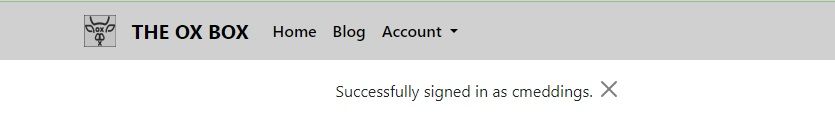
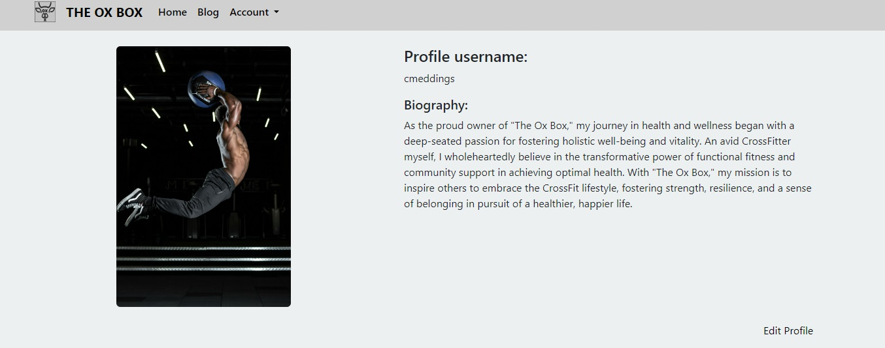

# __Portfolio Project 4 - Full Stack__
## __The Ox Box__
 __*“Strong body, strong mind, strong life”*__

### __Demo__

The live site can be viewed here - ["INSERT TITLE HERE"]()

Github repository can be viewed here - [CMed01/portfolio-milestone-4](https://github.com/CMed01/portfolio-milestone-4/)

## Table of Contents
* [User Experience](#user-experience)
* [Technologies](#technologies)
* [Testing](#testing)
* [Deployment](#deployment)
* [Credits](#credits)

## __User Experience__

The Ox Box Project is designed to create a vibrant online community focused on holistic health and wellness. Users can review insightful blog content and register an account opening further opportunities to read, view and comment on both exercise routines and blog posts, fostering interaction and knowledge-sharing. Additionally, all users can directly reach out via a contact form, enabling individuals to seek personalised health advice from the owner. With dedicated sections for daily exercise workouts and a health and lifestyle blog, our website aims to empower users to embark on their journey towards a healthier and more fulfilling lifestyle.

### __User Stories__
- US01: Navigate the site
    - As a Site User I can view the landing page so that I can determine the purpose of the application
        - Acceptance criteria
            - I can access the home page and easily view the purpose of the site
            - I can use the menu bar to navigate through the sites content

- US02: Read about the site
    - As a user, I can click on the About link so that I can read about the site.
        - Acceptance criteria
            - I can navigate to the about section of the website.

- US03: View blog articles
    - As a user, I can read health and lifestyle blog articles so that I can learn about improving my well-being
        - Acceptance criteria
            - I can navigate to the blog section of the website.
            - I see a list of blog articles with titles and previews

- US04: Reach out for personlaised services (contact form)
    -  As a user, I can use the contact form to reach out for personalised health and lifestyle advice.
        - Acceptance criteria
            - I can navigate to the contact form section of the website.
            - I see a form with fields to input my name, email, subject, and message.
            - Upon submission, I receive a message successfully confirming form submission 

- US05: Account registration
    - As a new user, I can register for an account so that I can access the features of The Ox Box website.
        - Acceptance criteria
            - I can see a registration form with fields for my name, email, and password.
            - Upon successful registration, I receive a message confirming my registration.

- US06: Account login
    - As a registered user, I login into the website and access member content
        - Acceptance criteria
            - I can see a login form with fields for my email and password.
            - Upon successful login, I am redirected to the homepage of The Ox Box website.

- US07: Access registered user content
    - As a registered user, after logging in, I can view exercise workouts of the day
        - Acceptance criteria
            - I can navigate to the workouts section of the website.
            - I see a list of available workouts with details such as date, time, and description

- US08: Create, update and delete comments on workouts
    - As a registered user, I can read and delete comments on workouts so that I can share feedback or ask questions
        - Acceptance criteria
            - I can view the comment section below each workout.
            - I can write a comment and submit it
            - I can record my score for the workout.
            - I can delete or update my own comment

- US09: Create, update and delete comments on blog article
    - As a registered user, I can read, review and delete comments on blog articles so that I can engage with the content
        - Acceptance criteria
            - I can view a comment section below each blog article.
            - I can write a comment and submit it.
            - I can delete or update my own comment

- US10: Restrict access to register users 
    - As a non-registered user, I have limited access to certain features.
        - Acceptance criteria
            - I can view blog articles only
            - I cannot view or comment on blog articles
            - I cannot access, view or comment on workouts

- US11: Manage blog content
    - As an admin, I can create, review and delete blog content and approve submitted comments.
        - Acceptance criteria
            - I have access to a backend dashboard where I can add new blog content.
            - I can view pending comments and approve or reject them.

- US12: Manage workout content
    - As an admin, I have access to create, review and delete workout content and approve submitted comments.
        - Acceptance criteria
            - I can view and modify workout content.
            - I can comment on blog articles and workouts.

- US13: Review contact form submissions
    - As a super admin, I can access and review form submissions full control and access.
        - Acceptance criteria
            - I can access all features of the website.
            - I have exclusive access to review contact form submissions.

- US14: Control access for all users
    - As a super admin, I have full control and access to all content.
        - Acceptance criteria
            - I have superuser access for all features of the website.

### __Features__

#### __F01: Navbar__

The navbar is present on all pages of th site. It is used using bootstrap's navbar styles. When the user scrolls the navabr dissappears. The navbar remains responsive and on smaller devices the navbar collapses into a toggle menu.

The navbar contains clickable links for the user to navigate through the site.

There are two navbar views with different accessibkle links depending on the status of the user.

Non-authorised user

 

Authroised user - non-staff

 

Authroised user - non-staff

 

#### __F02: Landing page/About page__

Upon arrival to the home page, the user is greeted with a hero image detailing the website name and the motto for the site.

Hero image

 

Below the hero image, the user can read four short "about me" ariticles outlining the ambition of the owners and the purpose of the website.

There cards are editable within the admin page and the most recently updated articles (up to a maximum of 4) will be displayed, allowing the superuser cutomability for the landing page.

About me articles

 

#### __F03: Contact Form__

After the "about me" pieces all users can view a contact me section with a button which will open up a modal containing a submittable form. The form conatins fields that can be posted to the database for review by the superusers.

Contact section

 

Contact modal

 

#### __F04: User authentication__

Django AllAuth has been used to provide all authentication process throughout the site. Functions in each app have also been decorated with login requirements to provide extra security. The provided templates for registration, sign in and sign out have been tailored to match the design of the site. Upon successful actions with each authentication process a message is displayed to the user detailing the outcome of each action

Registration

 

Sign in

 

Sign out

 

Messages

 

#### __F04: User Profile__

Once a user has registtered and become an authorised user. A profile is automatically created for that user, where they are able to edit their profile biography. Currently only the user can view their own profile page - see future developments

Profile page

 

Profile edit

 

#### __F07: Blog/Workout articles__

Both the blog and workout pages function in similar ways however the workout pages are only viewable to authorised users after logging in. Non-authorised users can view the blog pages including any comments.

On arrival to either page, the user is greeted with an short detail of the purpose of the page followed by a list of pgainated articles with the most recently posted articles appearing first. The titles for each articles can be clicked to access the articles in more detail. Within each article there is the ability for the user to write, review and delete comments.

Blog page

 

Blog article example

 

Workout page

 

Workout article example

 

For all comments the authorised user can write, edit and delete, except for workout comments where authorised users cannot edit. Following successful comment actions, the user is redirected to the original aricle page and a message is displayed at the top of the page informing the user of the outcome of any actions.

Comment example

 

Comment submit

 

Messages

 

#### __F08 Admin__

Staff members have been given admin right to..... the following

Staff admin portal

 

 

A Superuser has access to review contact form submission and full control access.

Superuser admin portal

 

#### __Future__
- Improved data within profile page to include a list of all comments on blog pages and workout completed with associated scores
- On each workout article, to include a leaderboard of the scores submitted and verified.
- All registered users can click on the profile of any commenting author to view their profile with non-editable functions.
- Registered user communication

### __Design__
#### __Wireframes__
- [Figma](https://www.figma.com/) was used to design the wireframes for this project.
    - Changes post design:
        - Image styles on both the blog and workout pages were amended moving away from rounded image containers.
        - A display modal was implemented using javascript for the contact form
    
    - [Wireframes](https://github.com/CMed01/portfolio-milestone-4/blob/main/documentation/wireframes/wirefranes-figma.pdf) can be accessed via this link or through the GitHub repository (documentation -> wireframes)
    
#### __Data Models (ERD)__
- [LucidChat](https://www.lucidchart.com/) was used to create entity relationship diagrams for the data modals used in thsi project
    

    
Data modals

     

    

    

#### __Aesthetics__
- Typography
    - [Google Fonts](https://fonts.google.com/) was used to source the following fonts that were used throughout the project site.
        - Bebas Neue
        - Inter
- Images
    - All current images were copyright free sourced from [Pexels](https://www.pexels.com/).

- Colors
    - [Coolors](https://coolors.co/) was used to generate the color scheme for the project.
        

        
Colors scheme 

         

        
        

 
## __Technologies__
- [Neon](https://neon.tech/)

### __Languages__

* HTML
* CSS
* Javascript
* Python

### __Frameworks, programs and libraries__

* [Django]() - Framework used to create full stack
    * [AllAuth](https://docs.allauth.org/en/latest/) - use to provide authetication framework for project
* [Am I Responsive?](https://ui.dev/amiresponsive) - Used to create an image of the website on various screen sizes.
* [Heroku](https://www.heroku.com/) - Used to deploy the website

* [Neon]() - Database
* [Favicon](https://favicon.io/) - Used to create favicon
* [Font Awesome]()
* [Bootstrap 5](https://getbootstrap.com/)
    * [Pagination](https://getbootstrap.com/docs/4.0/components/pagination/)
* [Google Fonts](https://fonts.google.com/)
    - Bebas Neue
    - Inter
* [ChatGPT](https://chat.openai.com/) - used to create the test blogs.
* [WodWell](https://wodwell.com/) - used to create the library of workouts
* [Code Beautify](https://codebeautify.org/) - used to format code

## __Testing__
### __Validator testing__

* __[W3C Markup Validation Service](https://validator.w3.org/)__
    - Describe Test and Results

 

* __[W3C CSS Validation Service](https://jigsaw.w3.org/css-validator/)__
    - Describe Test and Results
    
 

* __[JavaScript Testing (JSHint)](https://jshint.com/)__
    - Describe Test and Results

 

* __Lighthouse testing using [PageSpeed Insights](https://pagespeed.web.dev/)__
    - Describe Test and Results

 

* __[CI Python Linter](https://pep8ci.herokuapp.com/)__
    - Describe Test and Results
    - 

### __Browser Compatability__

### __Test Cases and Results__

The below table details the test cases that were used. 

 

| Test number | User Story                                               | Test Description                                                                                                                                                                                                                                                                                                                                                                                                                                                                                                                                                                                                                                                                                                                                                                                                                                                                                                                 | Outcome |
| ----------- | -------------------------------------------------------- | -------------------------------------------------------------------------------------------------------------------------------------------------------------------------------------------------------------------------------------------------------------------------------------------------------------------------------------------------------------------------------------------------------------------------------------------------------------------------------------------------------------------------------------------------------------------------------------------------------------------------------------------------------------------------------------------------------------------------------------------------------------------------------------------------------------------------------------------------------------------------------------------------------------------------------- | ------- |
| TS01        | US01: Navigate the site                                  | Verify that users can access the home page and easily understand the purpose of the site. Validate that users can use the menu bar to navigate through the site's content.                                                                                                                                                                                                                                                                                                                                                                                                                                                                                                                                                                                                                                                                                                                                                    | Pass    |
| TS02        | US02: Read about the site                                | Validate that users can successfully navigate to the home page and view 4 short articles about the website                                                                                                                                                                                                                                                                                                                                                                                                                                                                                                                                                                                                                                                                                                                                                                                                                       | Pass    |
| TS03        | US03: View blog articles                                 | Validate that users can click on the Blog link within the nav bar On click the user is directed to the blog section of the website and can see a list of blog articles with titles and previews.                                                                                                                                                                                                                                                                                                                                                                                                                                                                                                                                                                                                                                                                                                                              | Pass    |
| TS04        | US04: Reach out for personlaised services (contact form) | Ensure that all users can click on the contact form button. On click a modal is displayed with an active form with fields to input their name, email and message. On submission a message is displayed                                                                                                                                                                                                                                                                                                                                                                                                                                                                                                                                                                                                                                                                                                                     | Pass    |
| TS05        | US05: Account registration                            | Validate that non-authorised users can view a registration link in the nav bar. On click the user is directed to the registration page and a form with fields for their name, email, and password is viewable. Upon successful registration, the user receives a confirmation message.                                                                                                                                                                                                                                                                                                                                                                                                                                                                                                                                                                                                                                     | Pass    |
| TS06        | US06: Account login                                      | Validate that non-authorised users can view a login link in the nav bar. On click the user is directed to the login page and a form with fields for username and password is viewable. Non-authorised attempts to sign in will be redirected Non-registered users can view and click on a register button (see T05) Registered users, following successful completion of the login in form, will be redirected to the homepage.                                                                                                                                                                                                                                                                                                                                                                                                                                                                                      | Pass    |
| TS07        | US07: Access registered user content                     | Validate that registered users, after logging in, can navigate to the workouts section of the website and see a list of available workouts.                                                                                                                                                                                                                                                                                                                                                                                                                                                                                                                                                                                                                                                                                                                                                                                      | Pass    |
| TS08        | US08: Create and delete comments on workouts             | Validate that authorised users only are able to see the link for workouts in the navbar after logging in. On click, authorised users are directed to the workout page and can view a paginated list of 6 articles. On click of an article, the authorised user is directed to the article page where the more information of the workout is posted The authorised user can submit their comment and workout scorce using the form displayed at the bottom of the article page. The authorised user's comments will be clearly identified as awaiting review on initial submission. After review by an admin staff and if approved this information will disappear and the comment will be available for view by all. The authroised user can also view approved comments or all self written comments. The authorised user can only delete their comments                                                   | Pass    |
| TS09        | US09: Create, update and delete comments on blog article | Validate that all users only are able to see the link for blog in the navbar. On click, authorised users are directed to the blog page and can view a paginated list of 6 articles. On click of an article, the authorised user is directed to the article page where the more information of the article is posted Only authorised users can submit a comment using the form displayed at the bottom of the article page. The authorised user's comments will be clearly identified as awaiting review on initial submission. After review by an admin staff and if approved this information will disappear and the comment will be available for view by all. The authroised user can also view approved comments or all self written comments. The authorised user can only delete their comments Non-authorised users can view the blog article and the comments, but cannot write, edit or delete. | Pass    |
| TS10        | US10: Restrict access to register users                  | Validate that non-registered users have limited access to certain features, including only being able to view blog articles, and not being able to view or comment on blog articles or access, view, or comment on workouts.                                                                                                                                                                                                                                                                                                                                                                                                                                                                                                                                                                                                                                                                                                     | Pass    |
| TS11        | US11: Manage blog content                                | Ensure that all staff members can create, review, and delete blog content and approve submitted comments. Also, validate that the admin has access to a backend dashboard where new blog content can be added and pending comments can be reviewed and approved or rejected.                                                                                                                                                                                                                                                                                                                                                                                                                                                                                                                                                                                                                                                     | Pass    |
| TS12        | US12: Manage workout content                             | Validate that all staff members can create, review, and delete workout content and approve submitted comments. Ensure that the admin can view and modify workout content and comment on blog articles and workouts                                                                                                                                                                                                                                                                                                                                                                                                                                                                                                                                                                                                                                                                                                               | Pass    |
| TS13        | US13: Review contact form submissions                    | In addition to the staff member functions, validate that only superusers can access and review contact form submissions with full control and access.                                                                                                                                                                                                                                                                                                                                                                                                                                                                                                                                                                                                                                                                                                                                                                            | Pass    |
| TS14        | \- US14: Control access for all users                    | Validate that only the superuser has full control and access to all content with superuser access for all features of the website.                                                                                                                                                                                                                                                                                                                                                                                                                                                                                                                                                                                                                                                                                                                                                                                               | Pass    |

### __Debugging__
- Merging Django with Neon
    - [Connect a Django application to Neon](https://neon.tech/docs/guides/django)
    - [Neon + Django Integration Example](https://community.neon.tech/t/neon-django-integration-example/411)
- Creating url link for admin page for authorised users
    - [Django](https://forum.djangoproject.com/t/cant-create-link-to-admin-page-in-my-template/12533) - "Can’t create link to admin page in my template"
- Using signal.py to automatically create a profile when a new user registers
    - [Django signals](https://docs.djangoproject.com/en/5.0/topics/signals/)
- Adding access control using mixins
    - [Django Mixins](https://docs.djangoproject.com/en/5.0/topics/auth/default/)

## __Deployment__

### __How this site was deployed__

1. Open an account with Heroku.

2. On the home dashboard of your account, select "New" then "Create new app".

3. Create an unique app name, select the region and click create.

3. Click on the _Settings_ tab and add the following build packs:
    * `heroku/python`
    * `heroku/nodejs`

4. Create the following _Config Var_ called `PORT`. Set this to `8000`

5. Click on the _Deploy_ tab and connect with GitHub.

6. Select the correct repository.

7. Chose between automatic deploy or manual deploy.

8. Once successfully deployed you can visit the working website.

### __How to clone the repository__

1. Go to the 
 repository on GitHub.

2. Click the "Code" button to the right of the screen, click HTTPs and copy the link there.

3. Open a GitBash terminal. 

4. Change the working directory to the location where you want the clone directory.

5. On the command line, type "git clone" then paste in the copied url (https://github.com/CMed01/portfolio-milestone-3) and press the Enter key to begin the clone process

## __Credits__

### __Content__

* All content was written by the developer

### __Code__

* Insert any links to where code was adapted

### __Acknowledegements__
